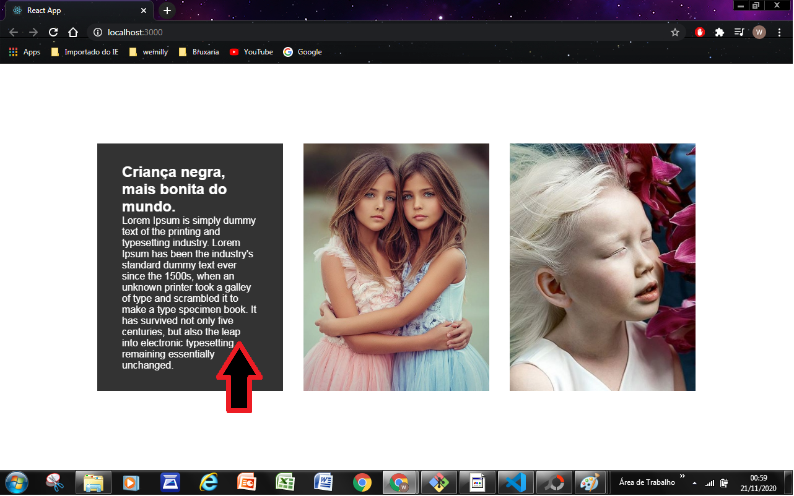
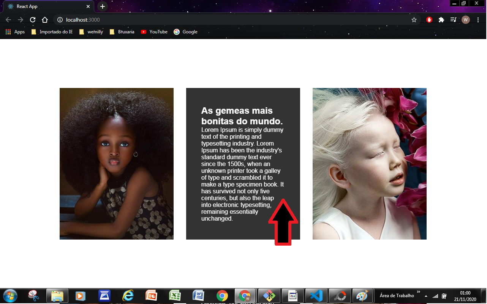
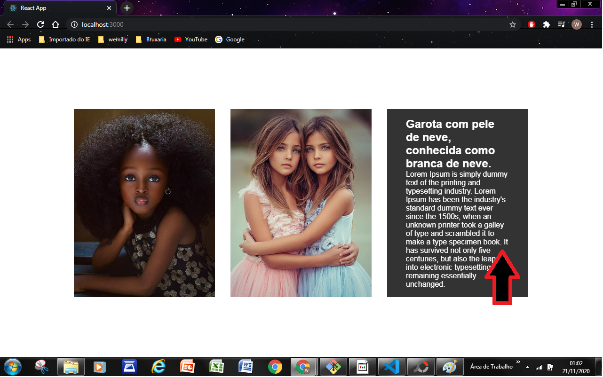

# Image Movement

### A foto 3D tem como movimentar a imagem, para trás dela, que demonstra o texto.
### Este projeto tem como objetivo criar habiliadades com componentização e CSS

Este projeto foi feito em:

<ul>
   <li><a href="https://developer.mozilla.org/pt-BR/docs/Web/HTML">HTML5</a></li>
    <li><a href="https://developer.mozilla.org/pt-BR/docs/Web/CSS">CSS3</a></li>
    <li><a href="https://developer.mozilla.org/pt-BR/docs/Web/CSS/CSS_Flexible_Box_Layout/Conceitos_Basicos_do_Flexbox">FlexBox</a></li>
    <li><a href="https://pt-br.reactjs.org/">React.js</a></li>
</ul>

_Espero que tenha gostado deste projeto e sinte-se avontade para contibuir.
Caso queira entrar em contato segue abaixo minhas redes sociais:_  
 ## 📫 Contatos   

   